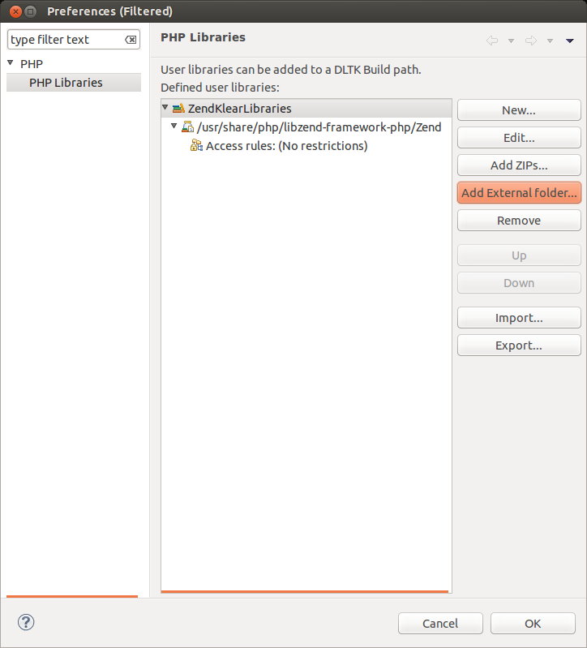

.. _createEclipseProjectLink:

Crear el proyecto en Eclipse
============================

.. note::
   Para que Eclipse no de problemas, antes de empezar a trabajar con Zend, primero crearemos un proyecto PHP en Eclipse en la carpeta de nuestro repositorio.

Pinchar en "Finish" hasta terminar con el asistente.