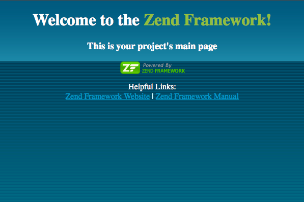

Crear proyecto Zend Framework
=============================

Un proyecto con Zend Framework necesita un sistema de carpetas para que pueda funcionar correctamente, aunque también
esta formalidad nos ayuda a ser ordenados a la hora de crear nuestros archivos y que así más adelante puedan ser leídos,
modificados, interpretados y encontrados por otros programadores, por si se necesita arreglar o añadir algo. Ahora para
incorporar este sistema abrimos un terminal:

Creación de un proyecto Zend
----------------------------

1. Desde nuestro terminal y estando en nuestra carpeta workspace/NuevoProyecto escribimos el siguiente código.

.. code-block:: console
   :emphasize-lines: 1

   $ zf create project web
   Creating project at /home/user/workspace/NuevoProyecto/web
   Note: This command created a web project, for more information setting up your VHOST, please see docs/README
   Testing Note: PHPUnit was not found in your include_path, therefore no testing actions will be created.

.. note::
   "web" es el nombre de la carpeta donde  estará nuestro proyecto.

Si todo ha salido bien, ahora nuestro proyecto debe tener la siguiente Estructura:

.. code-block:: console

   $ tree web
   web
   ├── application
   │   ├── Bootstrap.php
   │   ├── configs
   │   │   └── application.ini
   │   ├── controllers
   │   │   ├── ErrorController.php
   │   │   └── IndexController.php
   │   ├── models
   │   └── views
   │       ├── helpers
   │       └── scripts
   │           ├── error
   │           │   └── error.phtml
   │           └── index
   │               └── index.phtml
   ├── docs
   │   └── README.txt
   ├── library
   ├── public
   │   └── index.php
   └── tests
       ├── application
       │   └── controllers
       │       └── IndexControllerTest.php
       ├── bootstrap.php
       ├── library
       └── phpunit.xml

2. Para poder ver nuestro proyecto en el explorador web tenemos que crear un enlace en el directorio /var/www/ que apunte a la carpeta web/public/ de nuestro proyecto.

.. code-block:: console

    # ln -s /home/user/workspace/NuevoProyecto/web/public/ /var/www/nuevoproyecto

3. Para comprobar que el Zend se ha incorporado correctamente. Abrimos desde el navegador nuestro proyecto: localhost/nuevoproyecto
   y debe salir la típica presentación de Zend:

4. (Opcional) Este no es obligatorio para el uso de Klear pero puede ser útil para un futuro proyecto. Añadir la carpeta
   layout a nuestro sistema. Esta carpeta nos ayuda para trabajar con una plantilla que queremos que se repita durante todo
   nuestro proyecto, gracias a ella podríamos mantener una apariencia fija en nuestra web: encabezados, footer, botones
   de navegación, etc. Para activarlo, solo nos ubicamos en nuestro proyecto y activamos el siguiente código:

.. code-block:: console
   :emphasize-lines: 1

   $ zf enable layout
   A layout entry has been added to the application config file.
   A default layout has been created at /home/user/workspace/NuevoProyecto/web/application/layouts/scripts/layout.phtml
   Updating project profile '/home/user/workspace/NuevoProyecto/web/.zfproject.xml'

Entonces la estructura sería la siguiente:

.. code-block:: console
   :emphasize-lines: 10-12

   $ tree web
   web
   ├── application
   │   ├── Bootstrap.php
   │   ├── configs
   │   │   └── application.ini
   │   ├── controllers
   │   │   ├── ErrorController.php
   │   │   └── IndexController.php
   │   ├── layouts
   │   │   └── scripts
   │   │       └── layout.phtml
   │   ├── models
   │   └── views
   │       ├── helpers
   │       └── scripts
   │           ├── error
   │           │   └── error.phtml
   │           └── index
   │               └── index.phtml
   ├── docs
   │   └── README.txt
   ├── library
   ├── public
   │   └── index.php
   └── tests
       ├── application
       │   └── controllers
       │       └── IndexControllerTest.php
       ├── bootstrap.php
       ├── library
       └── phpunit.xml
