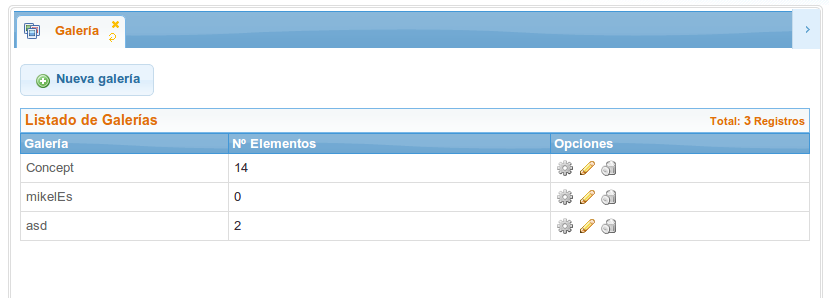
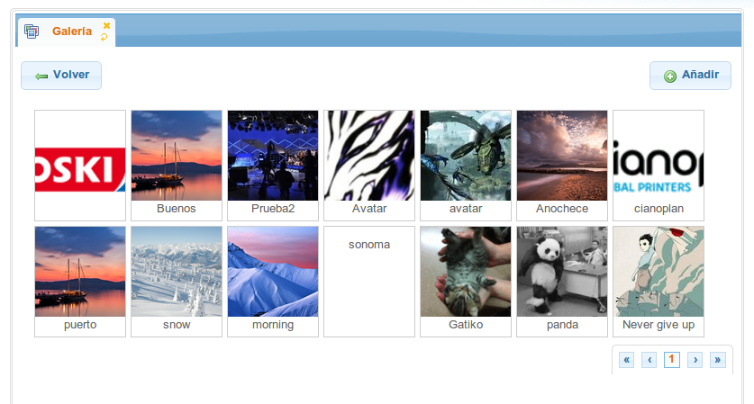
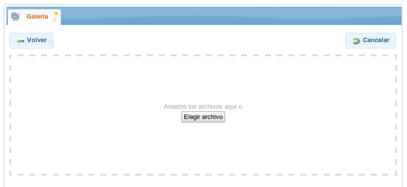
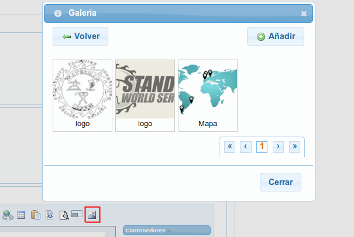

Klear Gallery
=============

.. attention::

   Si has descargado el pack completo de Klear, el módulo KlearGallery debe estar incorporado, sino añadir KlearGallery al directorio de módulos, al mismo nivel que klear y klearMatrix.

.. contents::
   :local:
   :depth: 2

Esquema de base de datos
------------------------

Crear estructura de base de datos, está constará de una tabla para galerías, imágenes y configuraciones de tamaños. Create tables ejemplo:

KlearImageGalleries
*******************

.. code-block:: mysql

   CREATE TABLE `KlearImageGalleries` (
    `id` mediumint(8) unsigned NOT NULL AUTO_INCREMENT,
    `name` varchar(120) DEFAULT '' COMMENT '[ml]',
    `name_es` varchar(120) DEFAULT NULL,
    `name_eu` varchar(120) DEFAULT NULL,
    PRIMARY KEY (`id`)
   ) ENGINE=InnoDB DEFAULT CHARSET=utf8 COMMENT='[entity]' ;

KlearImageGalleriesPictures
***************************

.. code-block:: mysql

   CREATE TABLE `KlearImageGalleriesPictures` (
     `id` mediumint(8) unsigned NOT NULL AUTO_INCREMENT,
     `idGallery` mediumint(8) unsigned NOT NULL,
     `picFileSize` int(11) unsigned DEFAULT NULL COMMENT '[FSO]',
     `picBaseName` varchar(100) NOT NULL DEFAULT '',
     `picMd5Sum` varchar(80) NOT NULL DEFAULT '',
     `picMimeType` varchar(80) NOT NULL DEFAULT '',
     `title` varchar(50) DEFAULT '' COMMENT '[ml]',
     `title_es` varchar(50) DEFAULT '',
     `title_eu` varchar(50) DEFAULT '',
     PRIMARY KEY (`id`),
     KEY `idGallery` (`idGallery`),
     CONSTRAINT `KlearImageGalleriesPictures_ibfk_1` FOREIGN KEY (`idGallery`) REFERENCES `KlearImageGalleries` (`id`) ON DELETE CASCADE ON UPDATE CASCADE
   ) ENGINE=InnoDB DEFAULT CHARSET=utf8 COMMENT='[entity]';

KlearImageGalleriesSizes
************************

.. code-block:: mysql

   CREATE TABLE `KlearImageGalleriesSizes` (
     `id` mediumint(8) unsigned NOT NULL AUTO_INCREMENT,
     `idGallery` mediumint(8) unsigned NOT NULL,
     `width` mediumint(8) unsigned NOT NULL,
     `height` mediumint(8) unsigned NOT NULL,
     `rule` enum('exact','crop','exactWidth','exactHeight') NOT NULL DEFAULT 'exactWidth',
     PRIMARY KEY (`id`),
     KEY `idGallery` (`idGallery`),
     CONSTRAINT `KlearImageGalleriesSizes_ibfk_1` FOREIGN KEY (`idGallery`) REFERENCES `KlearImageGalleries` (`id`) ON DELETE CASCADE ON UPDATE CASCADE
   ) ENGINE=InnoDB DEFAULT CHARSET=utf8 COMMENT='[entity]';

Configuración de la Galería
---------------------------

* Copiar y renombrar el fichero klearGallery/configs/klear/*example.klearGallery.yaml* a **APPLICATION_PATH**/configs/klear/*klearGallery.yaml* reemplazando el Appnamespace por el correspondiente a tu aplicación.

* Para añadir Gallery como sección de klear: Copiar y renombrar el fichero klearGallery/configs/klear/*example.GalleryList.yaml* a **APPLICATION_PATH**/configs/klear/*GalleryList.yaml* reemplazando el Appnamespace por el correspondiente a tu aplicación.

   * Será necesario vincular el listado a una clase que implemente la interfaz KlearMatrix_Model_Interfaces_Dashboard:

   .. code-block:: php

      <?php
      use Appnamespace\Mapper\Sql as Mapper;

      class Appnamespace_Model_CustomDashboardForGallery implements KlearMatrix_Model_Interfaces_Dashboard
      {
          protected $_config;
          protected $_item;

          public function setConfig(Zend_Config $config)
          {
              $this->_config = $config;
          }

          public function setItem(KlearMatrix_Model_ResponseItem $item)
          {
              $this->_item = $item;
          }

          public function getName()
          {
              $translator = Zend_Registry::get(Klear_Plugin_Translator::DEFAULT_REGISTRY_KEY);
              return $translator->translate("Galería");
          }

          public function getClass()
          {
              return "ui-silk-images";
          }

          public function getFile()
          {
              return "GalleryList";
          }

          public function getSubtitle()
          {
              $mapper = new Mapper\KlearImageGalleries;
              return $mapper->countAllRows();
          }
      }

Resultado
*********

Integración con wymeditor
-------------------------

Basta con añadir el plugin kleargallery al listado de plugins del editor.

.. code-block:: php

      type: textarea
      source:
        control: wym
        stylesheet: "../css/wymeditor.css"
        plugins:
          - hovertools
          - resizable
          - fullscreen
          - kleargallery

Resultado
*********

.. note::

   Esta movilidad también se ha incorporado en el **control: tinymce** como **Gallery**.

   .. image:: img/screen04.png