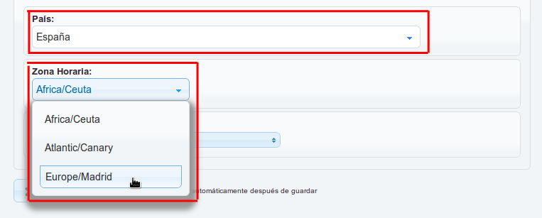
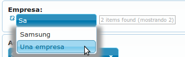

select
======

* Volver a :ref:`tipos_de_campos`

.. contents::
   :local:
   :depth: 3

Este campo nos listará los datos desde un mapper (los valores que tenemos en una base de datos) o de una lista manual.

.. _selectMapper:

Select Mapper
-------------

Este tipo de Select nos lista todas los valores que tenemos en una base de datos.

.. code-block:: yaml
   :emphasize-lines: 3-12

    fieldName:
      title: _('Field Name')
      type: select
      source: 
        data: mapper
        config: 
          'null': _("Sin asignar")
          mapperName: \MyApp\Mapper\Sql\Entity
          fieldName: 
            fields: 
              - name
            template: '%name%'
          order: name

* **attributes**: Añade un atributo al elemento “select” con el nombre indicado en la clave y el valor, en el ejemplo: <select data-autofilter-select-by-data=“field2:label”>. Si el nombre de la clave es “data-autofilter-select-by-data” se relaciona con otro “select” para mostrar solo datos relacionados con el valor elegido en este “select” (ver extraDataAttributes)
* **'null'**: Si acepta valor nulo, este será el texto que se mostrará en el campo si no selecciona algún valor.
* **mapperName**: el mapper del cual vamos a sacar los datos
* **fieldName**: el campo que mostramos. Puede ser solamente un campo (ejemplo, fieldName: entity_name) o varios campos indicados en fields y en template formamos el texto a mostrar, indicando cada campo entre %%
* **order**: el campo por el cual ordenamos al mostrar los valores en el “select”

.. _selectInline:

Select Inline
-------------

Este tipo de select nos lista los valores que le indiquemos manualmente.

.. code-block:: yaml
   :emphasize-lines: 3-11

    fieldName: 
      title: _('Field Name')
      type: select
      defaultValue: 0
      source: 
        data: inline
        values: 
          '0': 
            title: _("No")
          '1': 
            title: _("Yes")
            
* **values**: los valores a mostrar en el “select”. Se puede en forma de “clave:valor” o como en el ejemplo.
* **order**: si el valor es true, ordena los valores alfabeticamente a mostrar en el “select”. En caso contrario, los muestra en el orden que estén puestos en la configuración.

Ejemplo visualFilter
--------------------

Según la opción que elegimos en un select, podemos hacer aparecer u ocultar otros campos del SCREEN EDIT o NEW.

.. code-block:: yaml
   :emphasize-lines: 10-12,15-17

    fieldName: 
      title: _('Field Name')
      type: select
      defaultValue: 0
      source: 
        data: inline
        values: 
          '0': 
            title: _("No")
            visualFilter:
              show: ["Field", "Field2"]
              hide: []
          '1': 
            title: _("Yes")
            visualFilter:
               show: []
               hide: ["Field", "Field2"]
               
.. note::
   Por cada valor, podemos indicar que campos se muestra u ocultan. En nuestro ejemplo, al seleccionar el valor '0', Mostrará
   los campos 'Field' y 'Field2'. En cambio, el valor '1' las ocultará.
   
.. seealso:: 
   Aunque el ejemplo es del tipo :ref:`selectInline`, también funciona para el :ref:`selectMapper`.

Ejemplo data-autofilter-select-by-data / extraDataAttributes
------------------------------------------------------------

La opción de este Select solo funciona cuando una segunda tabla tiene relación con la primera. Su función consiste en que si es
elegido un valor en el primer select, el segundo select listará todos los valores de la otra tabla si están relacionadas.

.. note::
   Todo lo señado con el número **"1"** tienen relación con la primera tabla y **"2"** con la segunda tabla.

.. code-block:: yaml
   :emphasize-lines: 4-5,7,9-12,18,21-25
   
    field1Id: 
      title: _('field 1 Name')
      type: select
      attributes:
        data-autofilter-select-by-data: "field2Id:table1"
      source: 
        data: mapper
        config:
          'null': _("Unasigned")
          mapperName: \MyApp\Mapper\Sql\Entity1
          fieldName: name1 # Nombre de la columna que se listará en el Select
          order: name1

    field2Id: 
      title: _('Field 2 Name')
      type: select
      source: 
        data: mapper
        config: 
          'null': _("Unasigned")  
          mapperName: \Myapp\Mapper\Sql\Entity2
          fieldName: name2
          extraDataAttributes:
            table: field1Id
          order: name2

* **attributes**: Añade un atributo al elemento “select” con el nombre indicado en la clave y el valor, en el ejemplo: <select data-autofilter-select-by-data=“field2Id:table1”>. Si el nombre de la clave es “data-autofilter-select-by-data” se relaciona con otro “select” para mostrar solo datos relacionados con el valor elegido en este “select” *("extraDataAttributes")*.
* **extraDataAttributes**: a cada “option” del “select” añadir un “data-xxxxx”, donde “xxxxx” será la clave y en el valor irá el valor del campo “anotherFieldAtEntity”, que debe existir en el modelo del mapperName.

.. note::
   En resumen, se trata de dos select cuyo listado de uno, depende del otro. Más abajo le ponemos un ejemplo con la tabla **"Country"** y **"Timezones"**,
   donde **Timezones** tiene valores relacionados con los valores de **Country**. Tiene la función de listarme todas las zonas 
   horarias según al país que elija antes.

.. code-block:: yaml
   :emphasize-lines: 4-5,7,9-12,18,21-25

    countryId: 
      title: _('Country')
      type: select
      attributes:
        data-autofilter-select-by-data: "timezoneId:country"
      source: 
        data: mapper
        config:
	  'null': _("Unasigned")
          mapperName: \KlearInterval\Mapper\Sql\Countries
          fieldName: name
          order: name_${lang} 

    timezoneId: 
      title: _('Timezone')
      type: select
      source: 
        data: mapper
        config: 
          'null': _("Unasigned")
          mapperName: \KlearInterval\Mapper\Sql\Timezones
          fieldName: tz
          extraDataAttributes:
            country: countryId
          order: tz
          

.. note::
   **${lang}** es un valor que se ofrece cuando un usuario se identifica, tienes que ser configurado previamente. Relacionado con Auth Custom

.. _ejemploFilterClassSelect:

Ejemplo rawCondition
--------------------

Con esto filtramos el select de forma rápida sin necesidad de crear un filterClass.

.. code-block:: yaml
   :emphasize-lines: 9
   
    fieldName:
      title: _('Field Name')
      type: select
      source: 
        data: mapper
        config: 
          'null': _("Unasigned")
          mapperName: \MyApp\Mapper\Sql\Entity
          rawCondition: "name like 'irontec'"
          fieldName: 
            fields: 
              - name
            template: '%name%'
          order: name 
          
.. attention:: 

   Al usar rawCondition se ignora filterClass  

Ejemplo filterClass
-------------------

El ejemplo FilterClass del select es similar al :ref:`ejemploFilterClass` del Multiselect.

.. code-block:: yaml
   :emphasize-lines: 9

    fieldName:
      title: _('Field Name')
      type: select
      source: 
        data: mapper
        config: 
          'null': _("Unasigned")
          mapperName: \MyApp\Mapper\Sql\Entity
          filterClass: MyApplib_Filter_Name
          fieldName: 
            fields: 
              - name
            template: '%name%'
          order: name
          
.. note::
   Por formalidad, el siguiente archivo php lo solemos crear en nuestra carpeta **library/Applicationlib/Filter**.

.. code-block:: php
   :linenos:
   :emphasize-lines: 3,5,7-23,25-31

   <?php
   
   class MyApplib_Filter_Name implements KlearMatrix_Model_Field_Select_Filter_Interface
   {
       protected $_condition = array();
   
       public function setRouteDispatcher(KlearMatrix_Model_RouteDispatcher $routeDispatcher)
       {
           //Get Action
           $currentAction = $routeDispatcher->getActionName();
           
           //Get Controller
           $currentController = $routeDispatcher->getControllerName();
           
           //Get ModelName and your Controller
           $currentItemName = $routeDispatcher->getCurrentItemName();
           
           //NUESTRA CONDICIÓN CON CODIO WHERE MYSQL
           $this->_condition[] = "active = 1"; 
           //En este ejemplo decimos que solo muestre los valores cuyo campo Active = 1
           
           return true;
       }
   
       public function getCondition()
       {
           if (count($this->_condition) > 0) {
               return '(' . implode(" AND ", $this->_condition) . ')';
           }
           return;
       } 
       
   }

Ejemplo autocomplete
--------------------

.. code-block:: yaml
   :emphasize-lines: 13-15

   fieldName: 
     type: select
     source: 
       data: mapper
       config: 
         'null': _("Unasigned")
         mapperName: \MyApp\Mapper\Sql\Entity
         fieldName: 
           fields: 
             - name
           template: '%name%'
         order: name
     decorators:
       autocomplete:
         command: autocomplete_command
         
         
En el **YAML LIST** que usará el campo select autocomplete, la sección **"commands"** debe contener lo siguiente:
         
.. code-block:: yaml
   :emphasize-lines: 2-

   commands:
     autocomplete_command:
       <<: *Entity
       controller: field-decorator
       action: index
       autocomplete:
         mapperName: \MyApp\Mapper\Sql\Entity
         filterClass: Filter_Class_Name
         condition: 'value = 0'
         label: name 
         fieldName: 
           fields:
             - name
           template: '%name%'
         limit: 8 
         order: name
         matchAt: start
         ignoreWhereDefault: true
         
Propiedades Comandos
^^^^^^^^^^^^^^^^^^^^

* **mapperName**: El mismo del relatedMapperName, la entidad donde se buscará los valores.

* **filterClass**: Clase por la cual se filtra el resultado, **no vale con ponerlo en el model**, hay que definirlo dentro del command del autocomplete también. :ref:`ejemploFilterClassSelect`

* **condition**: Condición que se mete “en caliente”. Si filterClass está también definido saltará una excepción. Únicamente debe definirse uno de los dos.

* **label**: El mismo de “relatedFieldName”, listará los valores de dicho campo.

* **fieldName**: Si queremos mostrar más de un campo como label, se pueden definir varios y un template, igual que en la configuración de un select.

* **limit**: Número máximo de elementos que salen en el autocompletado (sale un campito al lado diciendo cuántos elementos hay en total).

* **order**: Campo por le cual se ordena el listado. Se puede añadir mas de un campo separado por **”,”**.

* **matchAt**: Indica en qué parte del campo buscar para mostrar los resultados del autocomplete. Si se omite la búsqueda se hace como **"like '%búsqueda%'"**. Las opciones posibles son:

   * **start**: La búsqueda se hace como **"like 'busqueda%'"**.
   * **end**: La búsqueda se hace como **"like '%busqueda'"**.

* **ignoreWhereDefault**: Ignora el WHERE por defecto del campo y solo emplea la condicional del **filterClass**.

