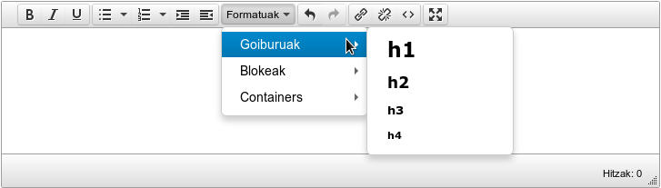
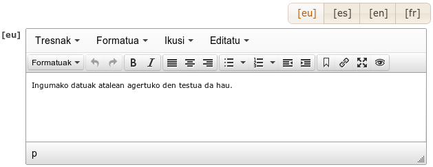
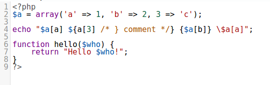

========
textarea
========

* :ref:`Volver a Tipos de Campos <tipos_de_campos>`

Campo del tipo **textarea**, normalmente utilizado para campos
que tienen que albergar mucho contenido de texto o diréctamente **HTML**.

.. contents::
   :local:
   :depth: 3

Configuración
=============

Básica
------

La configuración mas básica de este tipo de campo se hace de la siguiente forma.

.. code-block:: yaml

   fieldName:
     title: _("Título del campo")
     type: textarea

Ésta configuración mostraría un campo como el de **text** pero mayor en tamaño.

Se suele usar para escribir una pequeña descripción por ejemplo.

TinyMCE
-------

Éste tipo de campo se utiliza para mostrar un editor avanzado en lugar de una
caja de texto simple.

Dentro del **TinyMCE**, están preconfiguradas trés plantillas:

simple
^^^^^^

Muestra pocas opciones, ideal para comentarios y textos cortos puntuales.

.. code-block:: yaml

   fieldName:
     text: 
       title: _("Nombre del campo")
       type: textarea
       source: 
         control: Tinymce
         template: simple
         settings:
           theme: modern
           collapseLanguageBoxes: true

html5
^^^^^

Muestra pocas opciones, pero añade control de bloques en html5,
ideal para secciones, comentarios y textos.

.. code-block:: yaml

   fieldName:
     text: 
       title: ngettext('Text', 'Texts', 1)
       type: textarea
       source: 
         control: Tinymce
         template: html5
         settings:
           theme: modern
           collapseLanguageBoxes: true

html5min
^^^^^^^^

Igual que html5 pero muestra menos elementos en el toolbar.
Los elementos que se muestran son:

   - Negrita
   - Itálica
   - Subrayado
   - Lista de viñetas
   - Lista numerada
   - Incrementar sangría
   - Disminuir sangría
   - Deshacer
   - Rehacer
   - Insertar/editar enlace

.. code-block:: yaml

   fieldName:
     text: 
       title: ngettext('Text', 'Texts', 1)
       type: textarea
       source: 
         control: Tinymce
         template: html5min
         settings:
           theme: modern
           collapseLanguageBoxes: true

debug
^^^^^

Muestra casi todas las opciones posibles.

.. code-block:: yaml

   fieldName:
     text: 
       title: ngettext('Text', 'Texts', 1)
       type: textarea
       source: 
         control: Tinymce
         template: debug
         settings:
           theme: modern
           collapseLanguageBoxes: true

Variables comunes
^^^^^^^^^^^^^^^^^

* **settings**: dentro de esta sección se definen las variables propias del **TinyMCE**.
* **collapseLanguageBoxes**: si es **true**, solo se muestra el cuadro de un idioma cada vez,
  también se añade un selector de idioma para poder cambiar de uno a otro. Solo funciona con
  campo multi-idioma obviamente.

CodeMirror
----------

Esta configuración muestra un editor de código.

* **mode**: define el lenguaje que se va a usar en el editor.
* **lineNumbers**: booleano que especifica si se muestra la numeración de las filas. Por defecto false.
* **matchBrackets**: cuando es true, resalta las parejas de paréntesis cuando el cursor está cerca de ellos. Por defecto true.
* **theme**: el tema del editor. Si no se pone se usa el tema por defecto.
* **tabSize**: El tamaño de los tabuñadores. Por defecto 4.
* **readOnly**: se muestra el campo no editable. Por defecto false.
* **autofocus**: Al cargar la página, el cursor aparece en este textarea. Por defecto false.
* **dragDrop**: Permite cargar un fichero en el campo arrastrándolo al mismo. Por defecto true.

.. code-block:: yaml

   fieldName:
     text: 
       title: ngettext('Text', 'Texts', 1)
       type: textarea
       source:
        control: Codemirror
        settings:
          mode: php
          lineNumbers: true  
          matchBrackets: true
          theme: twilight
          tabSize: 2
          readOnly : true
          autofocus: true
          dragDrop: false
  
